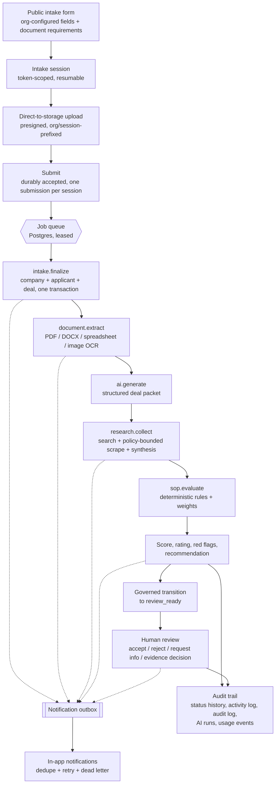
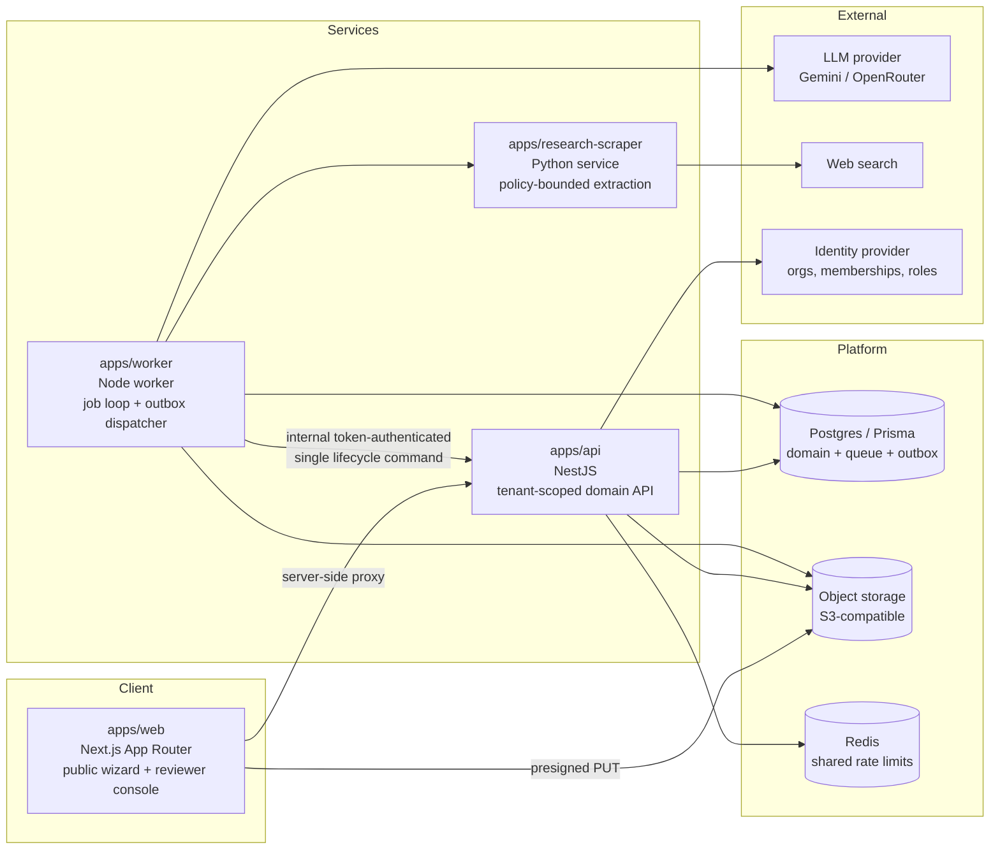

# AIDeal — AI-Powered Deal Intake & Operations Automation

[](https://github.com/Alimecsy/AIdeal-automation-showcase/actions/workflows/quality-gate.yml)

A working system that takes an inbound financing/trade request from a public intake form all the way to a scored, evidence-backed recommendation sitting in a human reviewer's queue — with the AI steps contained inside a governed, retryable, auditable workflow.

> **Portfolio snapshot.** This is a sanitized public snapshot of a privately developed project, published as engineering evidence. See [About this repository](#about-this-repository).

---

## What it does

Organizations that evaluate financing, trade, or credit requests receive the same request over and over: a form, a stack of supporting documents, some background checking, and a policy checklist that decides whether the request is worth a human's time. AIDeal automates that intake-to-recommendation path. An applicant fills in a configurable public form and uploads documents; the system extracts the document contents, gathers and attributes external research, scores the request against the organization's own SOP rules, produces a rating and a recommendation, and hands a reviewer a single screen with the evidence attached. Every state change is recorded, every notification is written through a durable outbox, and every background job is safe to retry.

## The manual workflow being automated

Without this system, an operations analyst typically:

1. Receives a request by email or through a generic form, and re-keys it into a spreadsheet or CRM.
2. Chases the applicant for missing documents, then opens each PDF, scan, or spreadsheet by hand.
3. Copies key facts (legal name, jurisdiction, registration number, amounts) out of those documents.
4. Searches the web for the company, reads a handful of sources, and writes up what could and could not be confirmed.
5. Walks a policy checklist — required documents, mandatory fields, red flags — and assigns a rating.
6. Writes a recommendation, then escalates it to whoever is allowed to decide.
7. Communicates the outcome and, if anyone remembers, records it somewhere auditable.

That loop is slow, inconsistent between analysts, and nearly impossible to audit after the fact. AIDeal performs steps 1–6 automatically and puts a human at the decision, with the supporting evidence already assembled and attributed.

## Automated workflow



Everything on that diagram exists in this repository. [Where to look](#where-to-look-in-the-code) maps each box to a file.

## Architecture



Shared contracts live in `packages/`: `@aideal/shared` (notification and usage event vocabulary, job payload types), `@aideal/db` (Prisma schema and client), `@aideal/env` (one Zod-validated environment schema used by every service).

Two boundaries are worth calling out, because they are the non-obvious decisions:

- **The queue is Postgres, not a broker.** Jobs are rows carrying a lease token, an attempt counter, and a next-attempt time. A crashed worker's lease expires and the job is recovered; a stale worker's write is rejected because its lease token no longer matches. Keeping job state in the same database — and often the same transaction — as the domain state it mutates is what makes retries genuinely safe rather than hopefully safe.
- **The worker cannot move a deal's status directly.** It calls one narrowly-scoped, token-authenticated command (`POST /api/internal/deals/:id/review-ready`) so the lifecycle state machine, its validation, and its audit records have exactly one owner. See [`internal-deals.controller.ts`](apps/api/src/modules/deals/internal-deals.controller.ts) and [`deal-transitions.ts`](apps/worker/src/deal-transitions.ts).

## Automation & AI implementation

The split below is the point of the project. AI is a bounded step inside a deterministic workflow, not the workflow itself.

| Concern | Deterministic | AI |
| --- | --- | --- |
| Intake validation, required documents, submission size limits | ✅ [`intake-forms.service.ts`](apps/api/src/modules/intake-forms/intake-forms.service.ts) | — |
| File-type enforcement (magic-byte signature checks) | ✅ [`r2-storage.service.ts`](apps/api/src/modules/storage/r2-storage.service.ts) | — |
| Text extraction from PDFs, DOCX, spreadsheets, scans | ✅ parsers + OCR, [`document-extraction.ts`](apps/worker/src/document-extraction.ts) | — |
| Turning extracted text + answers into a structured deal packet | — | ✅ prompted, versioned (`deal-packet-v1`), JSON-parsed with a fallback |
| Gathering research sources | ✅ policy-bounded fetching, [`apps/research-scraper`](apps/research-scraper/main.py) | ✅ query formulation and synthesis |
| Separating verified facts from unverified claims | — | ✅ every claim carries `sourceIds` and lands as `provisional` |
| **Scoring, rating, red flags, recommendation** | ✅ **entirely deterministic** — [`sop-evaluation.ts`](apps/worker/src/sop-evaluation.ts) | — |
| Deal status transitions | ✅ explicit transition map, [`deals.service.ts`](apps/api/src/modules/deals/deals.service.ts) | — |
| The decision | ✅ human reviewer | — |

Three consequences of that split:

1. **No model output can change a deal's status.** The SOP evaluator takes the AI's structured output as *input data* alongside form answers and document state, then applies the organization's configured weights and rules. The same inputs always produce the same score, and the score is explainable by construction — `categoryScores` records what each category earned, out of what weight, and why.
2. **Research output is evidence, not truth.** Synthesized claims are typed as `verifiedFacts`, `unverifiedClaims`, `inconsistencies`, or `redFlags`, each with source IDs and `provisional` status. A reviewer records an explicit evidence decision; confirmed red-flag evidence and outstanding follow-ups then feed back into re-evaluation.
3. **AI calls are recorded.** Each call creates an `AiRun` row with provider, model, prompt version, input references, and status, plus a `UsageEvent` — so behavior and cost are inspectable per organization.

The provider sits behind one adapter ([`ai-adapter.ts`](apps/worker/src/ai-adapter.ts)); Gemini and OpenRouter are both implemented.

## Reliability / production-minded design

This is what separates a workflow from a demo, so it is where most of the engineering went.

| Pattern | Implementation |
| --- | --- |
| **Duplicate submission prevention** | One submission per intake session, enforced by a database unique constraint. A concurrent duplicate hits the constraint, is caught, and returns the original submission rather than creating a second deal. |
| **Crash / restart safety** | Jobs are claimed with a 5-minute lease and a random lease token, heartbeated at ⅓ of the lease. If a worker dies, the lease expires and another worker recovers the job. |
| **Stale-worker protection** | Every terminal write (complete, retry, fail, heartbeat) is a conditional `updateMany` matching the lease token. A revived zombie worker's write affects zero rows and is logged as `job.stale_lease_write_rejected` instead of silently corrupting state. |
| **Retry with backoff** | Exponential, 1s doubling to a 30s cap, bounded by a per-job `maxAttempts`. |
| **Idempotency** | The finalizer does all of its work in one transaction and uses tenant-scoped atomic upserts (`organizationId + legalName + jurisdiction`, `organizationId + email`, `intakeSubmissionId`) so a lease-recovered retry cannot create a duplicate company, applicant, or deal. The uniqueness is enforced by Postgres, not by a read-then-create check. |
| **Transactional outbox** | Notifications are written to a `NotificationOutbox` row *inside the same transaction* as the domain change, then delivered by a separate dispatcher. A delivery failure can never fail — or silently roll back — the originating workflow. |
| **At-least-once delivery + dedupe** | Delivery is at-least-once; consumers deduplicate on `organizationId + dedupeKey`, enforced by a unique index, so redelivery is a no-op. |
| **Dead-letter + operator replay** | After 10 attempts (backing off to 24h) a row is dead-lettered. `replay()` requeues it without mutating its immutable event snapshot — deliberately a manual operator action, not an automatic retry path. |
| **Superseded-work detection** | A queued SOP re-evaluation checks for a newer active evaluation of the same deal and stands down, so a slow retry cannot overwrite a fresher result. |
| **Governed state machine** | An explicit `Record<DealStatus, DealStatus[]>` transition map; every state-changing review action writes `DealStatusHistory` plus audit records. |
| **Tenant isolation** | Organization scope is carried on every domain row and asserted at the query boundary; a body-supplied organization that disagrees with the authenticated one is rejected. Storage keys are prefixed per organization and session. |
| **Migration safety** | Migrations run through a wrapper that refuses to target the application database, requires an explicit disposable or local target, and demands a reviewed fingerprint approval — behavior pinned by its own test suite. |
| **Failure observability** | Structured JSON telemetry on every job lifecycle event; failure paths persist a useful error message and update dependent domain state rather than leaving a deal stuck. |

## Technology

TypeScript throughout, plus one Python service.

- **Web** — Next.js (App Router) + React 19, server-side API proxy, hand-written CSS (no UI framework)
- **API** — NestJS 11, Zod validation, guard-based organization/role authorization
- **Worker** — a plain Node process: poll loop, job processor, outbox dispatcher
- **Data** — PostgreSQL via Prisma 6 (pooled Neon driver adapter), SQL migrations checked in
- **Storage** — S3-compatible object storage via the AWS SDK, presigned uploads
- **Auth** — Clerk (organizations, memberships, roles)
- **AI** — Google Gemini / OpenRouter behind one adapter
- **Extraction** — `pdf-parse`, `xlsx`, `tesseract.js` OCR
- **Research** — Tavily search plus a Python (Scrapling) extraction service enforcing robots, SSRF, concurrency, and caching policy
- **Rate limiting** — Upstash Redis with a process-local fallback
- **Tooling** — pnpm workspaces, Turborepo, `node:test`, Prettier, GitHub Actions

## Repository structure

```
apps/
  web/                Next.js app: public intake wizard + reviewer console
  api/                NestJS API: intake, deals, documents, jobs, notifications, usage
  worker/             Job processor, AI/research/SOP handlers, notification outbox
  research-scraper/   Python extraction service with fetch-policy enforcement
packages/
  db/                 Prisma schema, SQL migrations, migration-safety wrapper
  shared/             Notification + usage event contracts, job payload types
  env/                Single Zod-validated environment schema
  tsconfig/           Shared TypeScript configs
docs/
  ARCHITECTURE.md           Module boundaries and invariants (the implementation contract)
  NOTIFICATION-EVENTS.md    Event envelope, delivery policy, dedupe rules
  SECURITY-VERIFICATION.md  What tests cover vs. what needs live verification
  OPERATIONS-RUNBOOK.md     Staging release, migration, rollback, smoke checks
  ENGINEERING-STANDARDS.md  The standards this codebase is held to
  portfolio/                Reviewer walkthrough + synthetic sample data
```

### Where to look in the code

If you have ten minutes and want to judge the engineering rather than the prose:

| To see… | Read |
| --- | --- |
| Lease claim, heartbeat, retry, stale-write rejection | [`apps/worker/src/job-processor.ts`](apps/worker/src/job-processor.ts) |
| Idempotent finalization in one transaction | `IntakeFinalizationHandler`, same file |
| Deterministic scoring and rating | [`apps/worker/src/sop-evaluation.ts`](apps/worker/src/sop-evaluation.ts) |
| Transactional outbox, dead letter, replay | [`apps/worker/src/notification-outbox.ts`](apps/worker/src/notification-outbox.ts) |
| Evidence typing and source attribution | [`apps/worker/src/research.ts`](apps/worker/src/research.ts) |
| Duplicate-submission handling | `submitSession` in [`apps/api/src/modules/intake-forms/intake-forms.service.ts`](apps/api/src/modules/intake-forms/intake-forms.service.ts) |
| Deal state machine + audit history | [`apps/api/src/modules/deals/deals.service.ts`](apps/api/src/modules/deals/deals.service.ts) |
| Upload security (presign scope, magic bytes) | [`apps/api/src/modules/storage/r2-storage.service.ts`](apps/api/src/modules/storage/r2-storage.service.ts) |
| Migration blast-radius guard | [`packages/db/scripts/run-prisma-migration.ts`](packages/db/scripts/run-prisma-migration.ts) |
| The tests that pin all of the above | [`apps/api/tests/`](apps/api/tests/), [`apps/worker/tests/`](apps/worker/tests/), [`packages/db/tests/`](packages/db/tests/) |

## Running locally

Requires Node 22 and pnpm 11. No external accounts are needed to install, lint, typecheck, test, or build.

```bash
corepack enable pnpm
pnpm install
cp .env.example .env
pnpm db:generate

pnpm lint         # project-wide typecheck-based lint
pnpm typecheck
pnpm verify       # format check + unit/contract tests + typecheck
pnpm build
pnpm demo:sop     # runs the real SOP evaluator against synthetic sample data
```

[The quality gate](.github/workflows/quality-gate.yml) runs the install, `pnpm db:generate`, and `pnpm verify` steps of that sequence on every push, so the badge above reflects a clean-checkout run of those checks on a machine that is not mine.

Running the *application* additionally needs a Postgres database, object storage, an auth provider, and an AI provider key. Fill in `.env` from `.env.example` — which contains placeholders only; no real values are published here — then:

```bash
pnpm db:migrate:local   # local, disposable database only; the wrapper enforces this
pnpm dev                # web + api + worker
```

The research scraper runs as a separate Python process:

```bash
python -m venv .venv && .venv/bin/pip install -r apps/research-scraper/requirements.txt
.venv/bin/python apps/research-scraper/main.py
```

## Demo / walkthrough

A step-by-step reviewer path — what to run, what to do, and what evidence each step should leave behind — is in **[docs/portfolio/WALKTHROUGH.md](docs/portfolio/WALKTHROUGH.md)**, with synthetic sample input and expected output shapes in [docs/portfolio/samples/](docs/portfolio/samples/).

The short version:

1. Start the services and open a configured intake form at `/forms/:slug`.
2. Submit the synthetic applicant answers and upload the sample document.
3. Watch the queue advance: `intake.finalize` → `document.extract` → `ai.generate` → `research.collect` → `sop.evaluate`.
4. Inspect the extraction, the research report with its source attribution, and the SOP evaluation breakdown.
5. Open the deal in the reviewer console and read the score, rating, red flags, and recommendation.
6. Record an evidence decision and a governed status transition.
7. Check the notification list and the deal's status history.

If you would rather not stand up providers, `pnpm verify` exercises the same reliability behavior directly: lease recovery, stale-write rejection, retry backoff, idempotent finalization, outbox dedupe and dead-lettering, the transition map, and deterministic scoring are all covered by tests that run with no external services.

> A recorded video walkthrough will be linked here once it is produced.

*Screenshots are not included in this snapshot: the reviewer console renders only against a live database, and no screenshot free of non-synthetic data was available to publish.*

## Development status

**AIDeal is a working system under active hardening. It is not a finished, deployed production product, and this repository does not claim otherwise.**

The end-to-end pipeline has been run against live providers: a public submission advanced `submitted → processing → review_ready` with document extraction, AI deal-packet generation, research collection, and SOP evaluation all completing, the governed transition accepted, and the notification outbox fully drained. That run needed configuration the documentation did not describe, which is recorded in the operations runbook.

Implemented, and covered by automated tests:

- Configurable intake forms, public sessions, presigned uploads, submission validation, duplicate prevention
- Durable Postgres job queue with leases, heartbeats, retry/backoff, and crash recovery
- Idempotent intake finalization, document extraction dispatch, AI deal-packet generation
- Research collection, source attribution, and evidence typing
- Deterministic SOP evaluation, scoring, rating, and recommendation
- Deal lifecycle state machine, review actions, status history, audit records
- Transactional notification outbox with dedupe, backoff, dead-lettering, and replay
- Organization scoping and authorization boundaries; migration safety wrapper

Incomplete or actively being hardened — stated plainly:

- **Two lifecycle mutations are missing, and they block the product's own happy path.** An intake form's status can only be set when it is created: there is no endpoint to publish a draft or archive a live form. SOP templates are worse — they are created `draft` by schema default and nothing in the API or UI can activate them, yet SOP evaluation requires an active template. Both are missing slices rather than broken ones: the statuses are modelled, enforced at the public boundary, and honoured by the worker; only the mutation to move between them was never built.
- **No production or staging deployment has been performed.** [`docs/OPERATIONS-RUNBOOK.md`](docs/OPERATIONS-RUNBOOK.md) is a validated plan, not a record of a release.
- **Email delivery is not implemented.** The notification event contract and the in-app consumer are built; the email provider settings in `.env.example` are reserved for that work and no provider send exists yet.
- Several security properties can only be confirmed against live providers — real presigned uploads, multi-instance Redis rate limiting, and identity-provider edge cases. [`docs/SECURITY-VERIFICATION.md`](docs/SECURITY-VERIFICATION.md) states precisely what the test suite does and does not prove.
- Magic-byte checks are a format-signature guard, not malware scanning or deep document validation.
- One integration test (live PDF extraction plus a live model call) is skipped unless real provider credentials are present.
- The reviewer UI is functional rather than designed.

## About this repository

This is a **sanitized portfolio snapshot** of a privately developed project, exported from the private working tree into fresh Git history. It intentionally omits private deployment configuration, environment values, infrastructure identifiers, internal planning and brainstorming documents, agent/orchestration working material, and generated local artifacts. Nothing omitted is implied to be present: `.env.example` contains placeholders only, and no credential, endpoint, bucket, account, or project identifier from the private environment appears anywhere in this tree.

All sample data under `docs/portfolio/` is synthetic. No real applicant, customer, or client information is present.

## Author

**Chimezie Stanley Ezenwafor**

I designed this system, specified its behavior, and drove its implementation. Concretely: mapping the manual deal-intake process into the workflow above; deciding where AI belongs and — more importantly — where it does not; designing the domain model, module boundaries, and the invariants recorded in [`docs/ARCHITECTURE.md`](docs/ARCHITECTURE.md); specifying the reliability behavior (leases, idempotency, the transactional outbox, the governed transition seam) as bounded implementation briefs with explicit acceptance criteria; reviewing and integrating the resulting code; and gating every change behind a verification suite I defined.

The implementation was produced with AI coding assistants working under those written briefs, with me as the architect and reviewer — specifying the boundary, reviewing the returned change against it, running the checks, and reworking what did not meet them. I state that plainly because it is how the system was actually built, and because directing AI agents to produce reliable, tested, reviewable code is itself part of what this repository is meant to evidence. The engineering judgment here — the architecture, the failure-mode analysis, the deterministic/AI split, the test contract — is mine.
